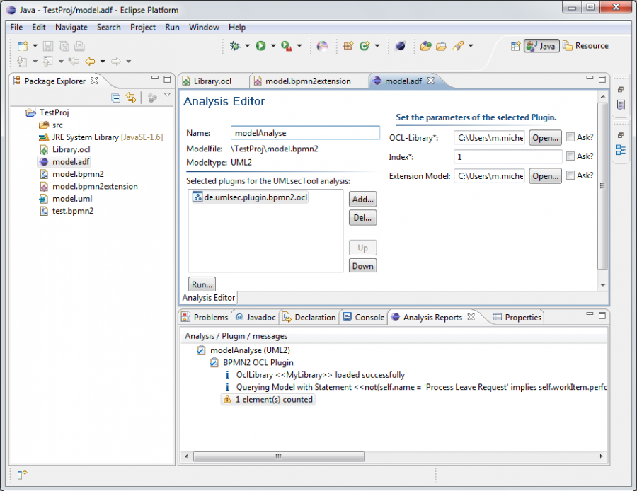

# CARiSMA

Modeling offers an unprecedented opportunity for high-quality critical systems development that is feasible in an industrial context. CARiSMA enables you to perform:

* compliance analyses,
* risk analyses, and
* security analyses

of software models. CARiSMA is an acronym for **C**ompli**A**nce, **Ri**sk, and **S**ecurity **M**odel **A**nalyzer.

Since CARiSMA is a reimplemented variant of the former UMLsec tool it natively supports UML models. Due to its EMF-based implementation CARiSMA can also support domain-specific modeling languages such as BPMN.

CARiSMA is fully integrated into Eclipse and can thus become part of the modeling tool of your choice including but not limited to Papyrus MDT, IBM Rational Software Architect, and many others.

A flexible plugin architecture makes CARiSMA extensible for new languages and allows users to implement their own compliance, risk, or security checks.

## Installation
See [Installation Guide](documentation/installation.md) for how to install CARiSMA and its extensions.

## General Usage
See [Usage Guide](documentation/usage.md) for information on how to use CARiSMA.

## Features
See [Features](documentation/README.md) for information on CARiSMA specific features.

## Development
If you want to extend CARiSMA, consult the [Development Guide](documentation/development.md).

## Video Documentation
There are multiple different [screencasts](https://cloud.uni-koblenz.de/s/kQy4GS3rR2MA4HJ) available on the CARiSMA-Tool 

## Contact / Team

If you find bugs, please use GitHub's issue tracker.

For other questions contact: [Research Group Software Engineering at University of Koblenz](https://www.uni-koblenz.de/de/informatik/ist/juerjens)

Contact:
* Jan Jürjens
* Julian Flake
* Sven Peldszus

Further developers and contributors:
* Sven Wenzel
* Daniel Poggenpohl, né Warzecha
* Benjamin Berghoff
* Jens Bürger
* Lidiya Kaltchev
* Johannes Kowald
* Kubi Mensah
* Marcel Michel
* Alexander Peikert
* Klaus Rudack
* Nils Rodewald
* Sanjeev Sun Shakya

## Licenses

CARiSMA uses various third party components which utilize a number of different [licenses](documentation/licenses.md). 
