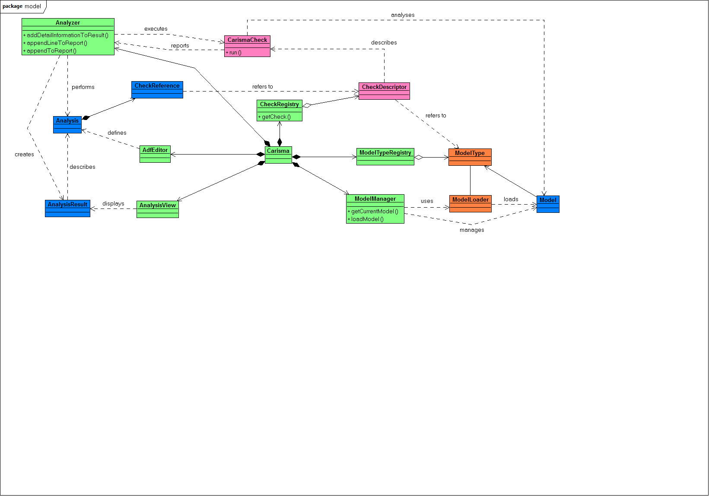

# Setting up CARiSMA for development
1. Install [Eclipse](installation.md#eclipse-modeling-tools)
2. Install [BPMN2 Modeler](installation.md#bpmn2-modeler)
3. Install [Papyrus](installation.md#papyrus)
4. If you already installed CARiSMA, delete the local installation.
5. Import the CARiSMA Tool from the [git repository](https://github.com/CARiSMA-Tool/carisma-tool).
6. Open a new Terminal 
7. Move to the base directory of the carisma-tool
8. Execute *mvnw.cmd clean install* on Windows or *./mvnw clean install* otherwise
9. Refresh the carisma-tool project.
10. All errors should be resolved.

To start your working copy of CARiSMA, right click on a plugin project, select "Run As" -> "Eclipse Application".

# Creating a Plugin Project containing CARiSMA Checks
1. Create a new Plug-in Project: New → Other → Plug-in Development → Plug-in Project
2. Enter your plugin name. The convention is **"carisma.check.[pluginName]"**.
3. Set output folder to `target`.
5. Click *Next*.
6. Enter the metadata for your plugin.
7. Click *Next*.
8. Select the *CARiSMA UML2 Check Template*.
9. Click *Next*.
10. Fill out the missing fields.
    * *Check ID* is a unique ID for your Check. You may choose the package name as the Check ID.
    * *Package Name* is the name of your Package.
    * *Class Name* is the name of your Java class implementing the check.
    * *Check Name* is the name of the check as part of the CARiSMA project.
    * *Check Description* is the description of the CARiSMA check.
    * *Publisher* should be your name or the name of your company.
    * *Target Model Type* is the Model-Type your check will work with.
11. Click *Next*.
12. If you want to create a preference page containing check-wide settings, check the corresponding option *Create a Preference Page*.
13. Select a *Page name*. *Class Name* and *Package Name* are the java Class Name/Package Name.
14. Click *Finish* to create your first CARiSMA check!

# The CARiSMA Tool Architecture
CARiSMA is implemented as an Eclipse-based plugin while itself has a plugin architecture to be easily extensible.
An excerpt of the contents of the main plugin *carisma.core* can be seen in the figure below.

The main class *Carisma* is registered as an Eclipse plugin and provides access to the various structures, serving as the controller for the different components of the tool.

An Analysis is executed on a Model of a certain ModelType registered within the ModelTypeRegistry. 
The models themselves are provided by the ModelManager and the ModelLoader for the corresponding ModelType.

CARiSMA executes analyses consisting of various CheckReferences to CheckDescriptors. 
These descriptors define the CarismaChecks that have been registered with the CheckRegistry. 
Each CarismaCheck may have any number of CheckParameters defined, which has a certain ParameterType. 
Checks may define pre- and post-conditions to use in combination with a blackboard (not pictured) to exchange information between them.

The AnalysisHost interface provides access to this blackboard, as well as methods for displaying the results of an Analysis in the AnalysisResultsView. 
The Analyzer is the main CARiSMA implementation of the AnalysisHost interface.

## Getting started developing with CARiSMA

### Introduction

While developing CARiSMA, we built some useful classes to ease development. In this section, we will present these classes.

### CARiSMA

#### Analysis Host

The interface `AnalysisHost` offers method stubs for the creation of structured reports for your analysis and for the exchange of data between different checks.

#### The ModelTypeRegistry

The model type registry manages the different types of models that are supported by CARiSMA. 
In order to have a more precise definition of which model types UMLsec2 supports, each model type is represented by a seperate plugin *carisma.modeltype.XXX* where *XXX* defines the model type, e.g. *uml2* or *bpmn2*. 
These plugins refer to the EMF-related plugins that implement the *model type* (they can also define the model type directly) and they provide routines for loading models of that type.

#### The ModelManager

The model manager is used to load models.

### UML

#### StateMachinePaths

This class gets all the possible paths through a state machine.
It is also able to get all state machines out of a model.
The most important method is `ArrayList<ArrayList<Element>> getPaths(final StateMachine stateMachine, final AnalysisHost analysisHost, final boolean transitions)`.
This method needs a state machine where it should get the paths out of, an AnalysisHost (null if you have none), and a boolean whether you also want the transitions occur in the result.

#### UMLStateMachineHelper

This class contains methods to easily manage a state machine.
Methods to get transitions to a given constraint or a target state.

#### ActivityDiagramManager

This class gets all possible paths out of an activity diagram.
The constructor `public ActivityDiagramManager(final Package model, final AnalysisHost host)` needs the model and an AnalysisHost for report (null if you have none).
Afterwards you can get all paths with `List<List<Element>> getAllPaths()`.

#### UMLHelper

This class contains convenience methods to easily access UML2 models.
For example, `getAllElementsOfType(Element inThisElement, Class<T> type)` returns all elements of a given type, `getElementByName(final Model model, final String adequatelyQualifiedName)` returns the element in the model specified by the name.

#### UMLDeploymentHelper

This class contains methods to easily manage a deployment diagram.
Methods to get specific elements or just a subset of them are provided here.

#### StereotypeApplication

A StereotypeApplication manages a Stereotype.
This class provides easy access to a Stereotype's attributes as its name or owner.

#### TaggedValue

A TaggedValue provides easy access to a Stereotypes's tags.
You can get the value (or values if the tag is multi-valued) of its corresponding Stereotype etc.

### UMLsec

#### UMLsecUtil

This class provides easy access to the profile's stereotypes and to applications of those.
For example, with `getStereotypedElements(final Package pkg)` you get all elements in the package to which a UMLsec Stereotype is applied, or with `getStereotypeApplication(final Element element, final UMLsec stereo)` you get the StereotypeApplication of the given Stereotype whenever the Stereotype is applied to the Element.

### UMLchange

#### UMLchangeUtil

This class provides easy access to the profile's stereotypes and to applications of those.
For example, `isProfileApplied(Package pkg)` returns true if the UMLchange Profile is applied to the given Package otherwise false.
Like `UMLsecUtil`, methods to get Stereotyped Elements, StereotypeApplication of Stereotypes etc. are provided here.

### BPMN

#### BPMN2Helper

This class contains convenience methods to easily access BPMN 2 models.
For example, `getAllElementsOfType(DocumentRoot rootElement, Class<T> type)` returns all elements of a given type, `getElementById(EObject rootElement, String id)` returns the element in the model specified by the Id.
Furthermore this class offers the ability to check if a defined model was created by the Yaoqiang Editor `isYaoqiangModel(String inFilePath)`.
If a Yaoqiang model is used during an Analysis the conversation is done automatically.
For a better integration and illustration the CARiSMA group modified the standard Yaoqiang Editor to easily mark security relevant elements.
If a critical element is identified the method `setWarningFlagToBpmn2Element(Bpmn2Element element, String description, Color color)` adds a flag with a defined color to the model element. To remove all warning flags in the model the method `clearAllWarningAndInfoFlags()` can be used.

# The Check Mechanism

The CARiSMA tool provides a mechanism that allows you to implement multiple checks in a single Eclipse Plugin.
The CARiSMA tool itself is only a host for the checks and coordinates their execution.
The mechanism is shown below.

## Implementing CarismaChecks

Creating a CARiSMA Check can be done automatically by using an Eclipse Template Project. CARiSMA checks need to extend the AnalysisCheck extension point and implement the CarismaCheck interface.

### Using the AnalysisCheck Extension Point

In the CARiSMA tool, checks are registered by the CheckRegistry.
To be registered, a plugin containing CARiSMA checks needs to extend the AnalysisCheck extension point.
This extension point lets the check developer define checks.

Each defined check has to be provided with certain meta information about it, which is displayed in the analysis editor.
The information that has to be provided is

- The ID, Name, Description and Publisher of the check
- The Model type to which this check can be applied to
- The Java class implementing this check

Optionally, some magic keys to identify models can be defined. CARiSMA looks for these keys in the model files.
If any key is found, a set of recommended checks is added to the list of checks in an analysis.

Check parameters are defined using this extension point.

There are seven parameter types: String, Boolean, Integer, Float, InputFile, OutputFile and Folder, which declares a folder to store the check output in.
Depending on the type, the analysis editor provides appropriate methods for setting parameter values.

After defining a check and its parameters, the CheckRegistry registers the check with CARiSMA on startup.
The meta information is stored in a CheckDescriptor, while the parameter information is stored in a CheckParameterDescriptor.
Registered checks are available to use in an analysis using the Analysis Editor.

Once an analysis is started, it receives CheckReferences which contain the set parameter values.

### The CarismaCheck Interface

A class implementing the CarismaCheck interface has to implement a single method.

`boolean perform(Map parameters, AnalysisHost host)`

This method is called by CARiSMA when a check is executed.
The check's parameters are given in a mapping from the parameter id to the corresponding parameter.
The given host can be used to access the analysed model, log check results to the AnalysisResultsView or a report produced by the analysis, and to access the blackboard provided by CARiSMA, which is used for exchanging data between checks.

### Pre-/Postconditions

CARiSMA Checks can be further described with pre- and postconditions.
While preconditions define which data is necessary for the check to be executed, postconditions tell CARiSMA of the data the check provides after successful execution.
This mechanism works in tandem with a blackboard which enables inter-check data exchange.

Before the execution of each check in an analysis, CARiSMA verifies that the preconditions imposed by the check are present in the blackboard.
If any precondition is missing, the analysis stops with an appropriate error.

With postconditions, CARiSMA ensures that the data the check says it provides is present in the blackboard.
If any postcondition is missing, CARiSMA again stops the analysis while producing an error.

#### Defining pre-/postconditions

Pre- and postconditions can be defined like adding parameters to a check.
Right-click on a defined CARiSMA check and select *New* → *precondition/postcondition* from the menu.
The only thing left to do is setting a value for the required or provided key of the condition.
This value is used by CARiSMA to search in the blackboard.

Defined pre- and postconditions are shown in the Analysis Editor along check parameters.

#### Using the blackboard to store and retrieve data

The blackboard can be accessed via the AnalysisHost interface.
`putToRegister(String registerName, Object data) throws RegisterInUseException`

Stores data in the blackboard if the key isn't already in use.
`Object getFromRegister(String registerName) throws RegisterNotInUseException`

Retrieves data from the blackboard if the key is in use.
`boolean isRegisterInUse(String registerName)`

Checks if the register is already in use.
`Object removeFromRegister(String registerName) throws RegisterNotInUseException`

Removes data from a register with the given key if it is in use.

### Generating Check Output

Checks are provided with various output channels. The Analyzer, the CARiSMA implementation of the AnalysisHost interface, allows checks to output messages to the AnalysisResultsView.

An AnalysisResultMessage given to the AnalysisHost consists of a StatusType (`INFO`, `WARNING`, `ERROR`) to prefix messages in the view with an appropriate icon, and the message to print.

Apart from the view, messages can also be sent to be printed with a report.
This report can be specifically generated by using the context menu in the AnalysisResultsView.
We recommend using the report for more detailed messages regarding the check.
