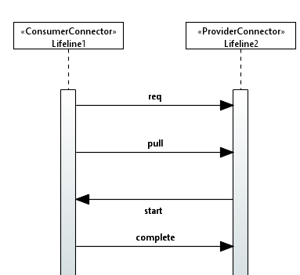
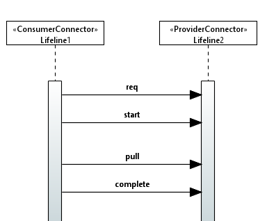
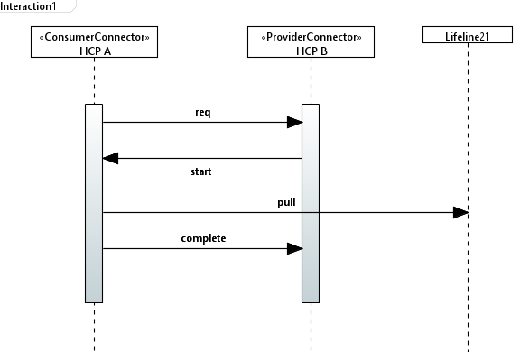
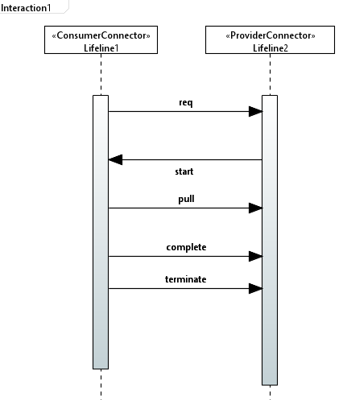
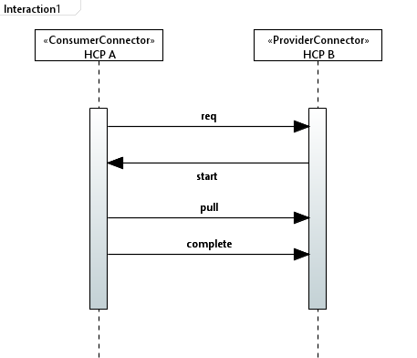

# Transfer Process Protocol Check
The Transfer Process Protocol analyses a Sequence Diagram to identify whether the data exchange
between the provider and consumer follows the Transfer Process Protocol set by the
IDS. The check utilizes the stereotypes, tags, and enums introduced in the Extension4IDS profile, namely, «ProviderConnector», «ConsumerConnector», «TransferProcessProtocol», TransferType (enum), {type = TransferType}, {transfer_req_step = message}, {transfer_start_step = message}, {transfer_complete_step = message}, {push_pull_step = message}, {transfer_terminate_
step = message} and {transfer_suspend_step = message}. Based on these values, the checks
analyze various constraints and determine whether the check is successful.

Figure below depicts a sequence diagram with incorrect order of transfer process protocol. The tag
values can also be seen in the figure below. In the figure, it can be seen that "Lifeline1" is annotated with «ConsumerConnector» and "Lifeline2" is annotated with «ProviderConnector», and the
whole interaction is also annotated with «TransferProcessProtocol». According to the TPP, the
"start transfer" step should be before the "push/pull" step, but in the figure, it can be seen
that the "push/pull" step comes before the "start transfer" step; this is a clear violation of the
TPP. So, when the Transfer Process Protocol Check is executed, the check fails, stating that the
order is violated; the check result is shown in figure 5.8 The check generates similar results for all other possible order violations that might occur.

Apart from the order violation, the check also analyzes if the sender and the receiver of the
relevant TPP messages are correct. In figure 4.10, it can be seen that the "transfer start" message
is sent by the consumer to the provider, but the TPP mandates that the "transfer start" messages
should be sent by the provider to the consumer. So, if the check is executed, the check fails
again with the result as shown in figure 5.10. The result again clearly states the reason for the
failure, and that is the "Transfer Start must be sent by the provider." For scenarios where the
sender and receiver of a message do not correspond to TPP, the check fails with a similar result.

Further, the check also analyses if the sender and receiver of the relevant message are the
lifelines annotated with «ConsumerConnector» and «ProviderConnector». For instance, in
figure 4.11, it can be seen that the "pull" step is sent from the consumer connector, but the
receiver is not the provider but some other lifeline; this is also a violation of the TPP. When the
check is executed, the check fails again, with the result as in figure 5.11. The result states that
the "Pull should be received by the provider," which is not true in this scenario. If not modeled
correctly, the check provides a similar result for all the other relevant messages.

Additionally, the check also fails when a step should not be present in the presence of another
step. For instance, in figure 4.12, it can be seen that, even though the "transfer complete" step is
present, the "transfer terminate" step is also present, which is also a violation of the TPP. Once a
transfer is complete, it cannot be terminated. Figure 4.13 shows the relevant tag information. In
this scenario, the check fails again, with the result shown in figure 5.12 indicating that "transfer
terminate" should not be present if "transfer complete" is present. The check works similarly
to all other messages.

Finally, one of the correct ways to model the sequence diagram so that the TPP check succeeds
can be seen in figure 4.14. Here, it can be seen that the order of the messages, the sender and
receiver of the messages, and the combination of relevant messages are correct. In this case, if
the check is executed, the check succeeds, which is also depicted in figure 5.13. Hence, in this
way, the Transfer Process Protocol check can be used to correctly model the Transfer Process
Protocol in a sequence diagram.

