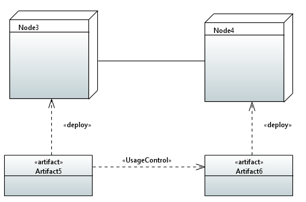
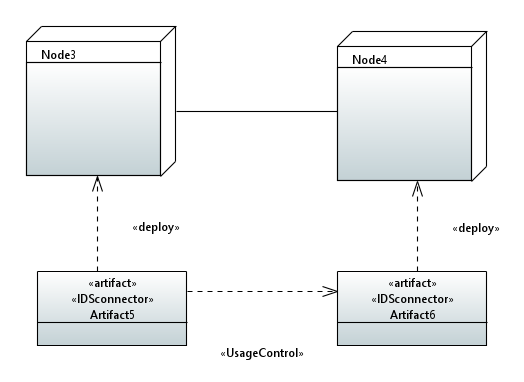

# Usage Control Check
The Usage Control check analyzes a deployment diagram annotated with usage control-specific
stereotypes from the extension4ids profile. Based on how the stereotypes «IDSconnector» and
«UsageControl» are used, the check determines if the usage control requirement is violated or
not. Multiple constraints need to be satisfied for the check to succeed. The implementation
of the Usage Control check is very similar to that of the secure links, the difference being the
attacker is assumed to be a "Malicious participant," and the compliance check focuses on the
presence of IDS connectors on the artifacts deployed on the nodes, rather than the type of communication link used. This approach ensures that usage control requirements are met based
on security requirements on the dependency link and the artifacts’ security features.

For instance, the model presented in figure illustrates that the dependency
link between the artifacts deployed in the "Node3" and "Node4" has «UsageControl» as
the requirement, but the artifacts deployed are not annotated with «IDSConnector» stereotype,
suggesting that these nodes don’t use IDS connector for data exchange. 

This indicates that the participants involved in the data exchange cannot guarantee usage control, or a malicious participant
can simply ignore the usage control policies associated with the exchanged data set.
So, if the Usage Control Check is executed in this model, the check fails with the result as
shown in figure below.

Similarly, in cases where only one of the participants has an IDS connector deployed, then also the check fails with a similar check result and report as for the model with
no IDS Connectors, as it is essential that all parties involved in data exchange must use IDS
connector. Finally, for models as in figure 4.5, the check will succeed.

The artifacts deployed in the nodes between the communication paths are
annotated with the «IDSConnector» stereotype, satisfying the constraints of the Usage Control
Check, so the check succeeds. Hence, the Usage Control check can be used to verify whether a
deployment diagram is modeled correctly with respect to the usage control requirement from
IDS. 