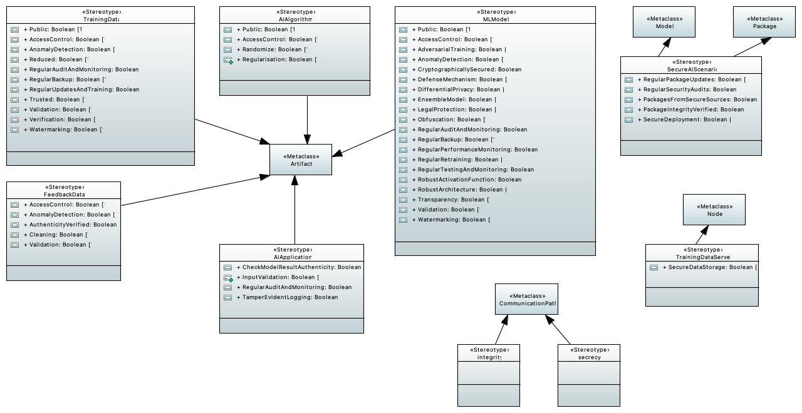

# Examples for the OWASP ML Security Top 10 checks

The primary source for the information relevant for the checks can be found [here](https://owasp.org/www-project-machine-learning-security-top-10/).
The 2023 ranking is as follows:

- ML01:2023 [Input Manipulation Attack](./input-manipulation-attack/README.md)
- ML02:2023 [Data Poisoning Attack](./data-poisoning-attack/README.md)
- ML03:2023 [Model Inversion Attack](./model-inversion-attack/README.md)
- ML04:2023 [Membership Inference Attack](./membership-inference-attack/README.md)
- ML05:2023 [Model Theft](./model-theft/README.md)
- ML06:2023 [AI Supply Chain Attacks](./ai-supply-chain-attack/README.md)
- ML07:2023 [Transfer Learning Attack](./transfer-learning-attack/README.md)
- ML08:2023 [Model Skewing](./model-skewing/README.md)
- ML09:2023 [Output Integrity Attack](./output-integrity-attack/README.md)
- ML10:2023 [Model Poisoning](./model-poisoning/README.md)

# Stereotypes and their Attributes (tagged values)

The profile defines the following stereotypes and stereotype attributes:

1. `<<SecureAIScenario>>`: This stereotype can be attached to a whole UML model or to a package within a deployment diagram. The stereotype has the following attributes:

    - *RegularPackageUpdates*: Boolean attribute that indicates whether the latest versions of the packages is used.
    - *RegularSecurityAudits*: Boolean attribute that indicates whether regular security audit of the system are completed.
    - *PackagesFromSecureSources*: Boolean attribute that indicates whether secure third-party software repositiories are used for package download.
    - *PackageIntegrityVerified*: Boolean attribute that indicates whether the digital signature of the package is checked before use.
    - *SecureDeployment*: Boolean attribute that indicates whether the system uses MLOps platforms and only has authorized personnel have access to it.	
    
	
2. `<<MLModel>>`: This stereotype can be attached to an artifact within a deployment diagram. The stereotype has the following attributes:

    - *Public*: Boolean attribute that indicates whether the model's code is available to the public.
    - *AccessControl*: Boolean attribute that indicates whether authentication, encryption, or other forms of security when accessing the model or its predictions are used.
    - *AdversarialTraining*: Boolean attribute that indicates whether the model is trained on adversarial examples.
    - *AnomalyDetection*: Boolean attribute that indicates whether the distribution of inputs and outputs is tracked, the model’s predictions to ground truth data are compared, or the model’s performance is monitored over time.
    - *CryptographicallySecured*: Boolean attribute that indicates whether the model employs methods like digital signatures and secure hashes to verify the authenticity of the results.
    - *DefenseMechanism*: Boolean attribute that indicates whether defense mechanisms to make models robust, like adversarial training and input transformations, are used.
    - *DifferentialPrivacy*: Boolean attribute that indicates whether differential privacy measures are used.
    - *EnsembleModel*: Boolean attribute that indicates whether multiple models are trained, using different subsets of the training data and use an ensemble of these models to make predictions.
    - *LegaProtection*: Boolean attribute that indicates whether legal protection for the model, such as patents or trade secrets, was secured.
    - *Obfuscation*: Boolean attribute that indicates whether random noise is added to the model's prediction.
    - *RegularAuditAndMonitoring*: Boolean attribute that indicates whether the model's use is regularly audited and monitored.
    - *RegularBackup*: Boolean attribute that indicates whether the model's sensitive information are backed up so they can be recovered.
    - *RegularPerformanceMonitoring*: Boolean attribute that indicates whether the performance of the model is regularly monitored.
    - *RegularRetraining*: Boolean attribute that indicates whether the model incorporates new data and corrects any inaccuracies in the model’s predictions when it is retrained.
    - *RegularTestingAndMonitoring*: Boolean attribute that indicates whether the model's behavior is tested and monitored for anomalies.    
    - *RobustActivationFunction*: Boolean attribute that indicates whether the model is designed with a robust activation function.   
    - *RobustArchitecture*: Boolean attribute that indicates whether the model is designed with a robust architecture.    
    - *Transparency*: Boolean attribute that indicates whether  all inputs and outputs are logged, explanations for the model’s predictions are provided, or users are allowed to inspect the model’s internal representations.
    - *Validation*: Boolean attribute that indicates whether the model uses a separate validation set that has not been used during training. 
    - *Watermarking*: Boolean attribute that indicates whether a watermark was added to the model's code to trace the source of a theft.
	
3. `<<TrainingData>>`: This stereotype can be attached to an artifact within a deployment diagram. The stereotype has the following attributes:

    - *Public*: Boolean attribute that indicates whether the training data is available to the public.
    - *AccessControl*: Boolean attribute that indicates whether it is limited who can access the training data and when they can access it.
    - *AnomalyDetection*: Boolean attribute that indicates whether anomaly detection techniques to detect any abnormal behavior in the training data, such as sudden changes in the data distribution or data labeling, are used.
    - *Reduced*: Boolean attribute that indicates whether the size of the training dataset is reduced or redundant or highly correlated features are removed.
    - *RegularAuditAndMonitoring*: Boolean attribute that indicates whether the training data is regularly monitored for any anomalies and conduct audits to detect any data tampering.
    - *RegularBackup*: Boolean attribute that indicates whether the training data is backed up so it can be recovered.
    - *RegularUpdatesAndTraining*: Boolean attribute that indicates whether the training data is regularly monitored and updated.
    - *Trusted*: Boolean attribute that indicates whether a secure and trusted training dataset is used.    
    - *Validation*: Boolean attribute that indicates whether the training data is thoroughly validated before model training.
    - *Verification*: Boolean attribute that indicates whether the training data is thoroughly verified before model training.
    - *Watermarking*: Boolean attribute that indicates whether a watermark was added to the training data to trace the source of a theft.
	
4. `<<AIAlgorithm>>`: This stereotype can be attached to an artifact within a deployment diagram. The stereotype has the following attributes:
    - *Public*: Boolean attribute that indicates whether the used algorithm configuration is available to the public.
    - *AccessControl*: Boolean attribute that indicates whether the algorithm implements strict access control measures, such as two-factor authentication.
    - *Randomize*: Boolean attribute that indicates whether the algorithm uses randomized or shuffled data during training.
    - *Regularisation*: Boolean attribute that indicates whether regularisation techniques such as L1 or L2 regularization are used.
	
5. `<<FeedbackData>>`: This stereotype can be attached to an artifact within a deployment diagram. The stereotype has the following attributes:

    - *AccessControl*: Boolean attribute that indicates whether only authorized personnel have access to the MLOps system and its feedback loops.
    - *AnomalyDetection*: Boolean attribute that indicates whether statistical or machine learning-based methods are used to detect and alert on anomalies in the feedback data.
    - *AuthenticityVerified*: Boolean attribute that indicates whether techniques such as digital signatures and checksums are used to verify that the feedback data received by the system is genuine.
    - *Cleaning*: Boolean attribute that indicates whether the feedback data is cleaned before using it to update the training data.
    - *Validation*: Boolean attribute that indicates whether the feedback data is validated before using it to update the training data.
        	
6. `<<AIApplication>>`: This stereotype can be attached to an artifact within a deployment diagram. The stereotype has the following attributes:

    - *CheckModelResultAuthenticity*: Boolean attribute that indicates whether methods like digital signatures and secure hashes are used to verify the authenticity of the results.
    - *InputValidation*: Boolean attribute that indicates whether the input data is checked for anomalies and rejects inputs that are likely to be malicious.
    - *RegularAuditAndMonitoring*: Boolean attribute that indicates whether regular monitoring and auditing of the results and the interactions are implemented to detect suspicious activities and respond accordingly.
    - *TamperEvidentLogging*: Boolean attribute that indicates whether a mechanism is implemented that ensures logs cannot be altered without detection.
    	
7. `<<TrainingDataServer>>`: This stereotype can be attached to a node within a deployment diagram. The stereotype has the following attribute:

    - *SecureDataStorage*: Boolean attribute that indicates whether the training data is stored in a secure manner, using encryption, secure data transfer protocols, and firewalls.
	
8. `<<integrity>>`: This stereotype can be attached to a communication path within a deployment diagram. 

9. `<<secrecy>>`: This stereotype can be attached to a communication path within a deployment diagram. 
