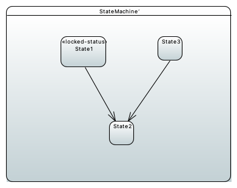
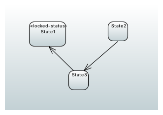

# Locked Status Check

In the incorrect example, there is an outgoing transition from State1 to State2.
Therefore, an locked status check for this example would fail, because State1 is annotated with the &lt;&lt;locked-status&gt;&gt; stereotype.

On the other hand, in the correct example, State1, which is annotated with the &lt;&lt;locked-status&gt;&gt; stereotype has only incoming transitions.
So a locked status check would succeed.

