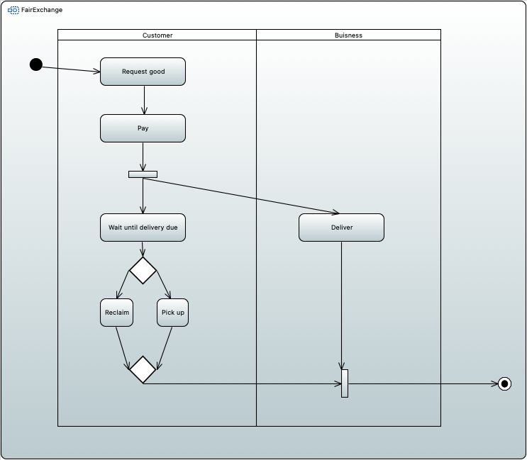
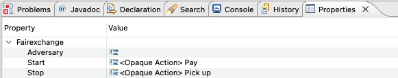
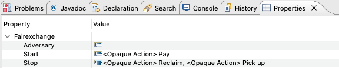

# Fair Exchange Examples
Here you can find examples for the fair exchange check.

This check ensures, that if an action in the start tag is executed, the action in the stop tag is executed as well.
Thereby it represents a security requirement that any transaction should be performed in a way that prevents both parties involved from cheating.

In the incorrect example, the &lt;&lt;fairexchange&gt;&gt; stereotype has the action `Pick Up` in the stop tag which has to be executed after the action `Pay` from the start tag was executed.
Since there is a decision node before the `Pick Up` action, it is not executed in every path within the diagram and a check will fail.

One can correct the model either by adding an action `Pick Up` to the other path after the decision node or add the action `Reclaim` to the stop tag.
In the correct model the action `Reclaim` was added into the stop tag.
So now, in every path one of the stop actions is executed and the check will be successful.

## Idea for improvement 
* Start- and Stop-Conditions are too restrictive
* it would be nice to have the possibility to express conditions more flexible, for example :
  * A –> C or D	
  * A –> C and D	
  * A —> C or B —> D
  * A —> C and B —> D
* Requirements to the notation/syntax of the condition: not too complex, especially the simple cases must remain usable and as expressive as possible without a steep learning curve
