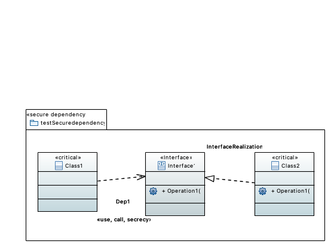
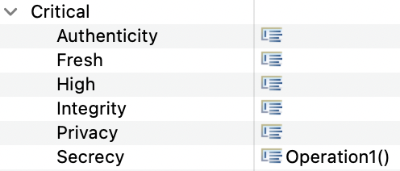

# Secure Dependency Examples
Systems are analyzed so that &lt;&lt;call&gt;&gt; and &lt;&lt;send&gt;&gt; dependencies between objects respect security requirements on data that may be communicated between them.
The &lt;&lt;call&gt;&gt; stereotype from an dependent to independent class indicates that instances of the dependent class may call operations of the independent class.
Therefore, the dependent class knows of instances of the independent class.
If the dependency points to an interface, the dependent class may only call operations listed in the corresponding interface specification.
This holds vice versa for &lt;&lt;send&gt;&gt;.
The security requirements are represented through the tags of classes with the &lt;&lt;critical&gt;&gt; stereotype.

"Class2" provides secrecy for "Operation1" in our incorrect example.
On the other hand, secrecy is not provided for "Operation1" by "Class1" and the check will fail since it calls the corresponding interface.

In the correct example, the secrecy stereotype is added to the dependency.
In addition to that, &lt;&lt;critical&gt;&gt; was added to "Class1" and provides secrecy to "Operation1" via its tags.

