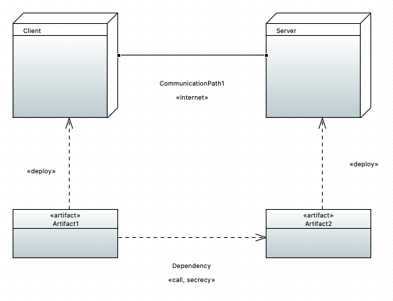
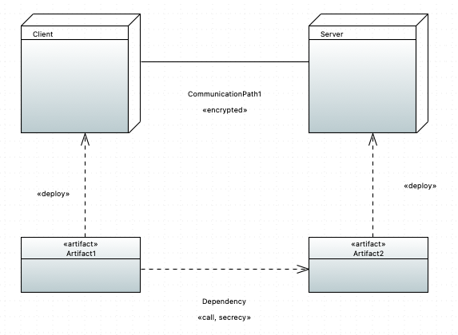

# Secure Links Examples
Here you can find examples for the secure links check.
The check ensures that security requirements are met by the physical layer, given a specified adversary.
The security of the linktype is determined in conjunction with the adversary type affecting the communication path.
Currently there are three types of adversaries, which are "default", "insider" and "custom".
- **Default** can read, insert and delete at a communication path annotated with &lt;&lt;Internet&gt;&gt; and only delete at &lt;&lt;encrypted&gt;&gt;.
- **Insider** can read, insert and delete at a communication path annotated with &lt;&lt;Internet&gt;&gt;, &lt;&lt;encrypted&gt;&gt; and &lt;&lt;LAN&gt;&gt;.
- **Custom** can read, insert and delete at a communication path annotated with &lt;&lt;Internet&gt;&gt; and only read at &lt;&lt;wire&gt;&gt;.

Here, for both examples are for a default adversary.
In the incorrect example the `CommunicationPath1` got annotated with the stereotype &lt;&lt;Internet&gt;&gt;.

A default adversary can delete, read and insert on an internet link and therefore a check on this model would fail, since e.g. &lt;&lt;secrecy&gt;&gt; on the `Dependency` is violated.
After looking into the report,  you can correct the stereotype to &lt;&lt;encrypted&gt;&gt; like in the correct example.
Here the default adversary can only delete and therefore the check would be successful.

