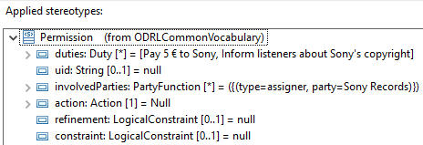
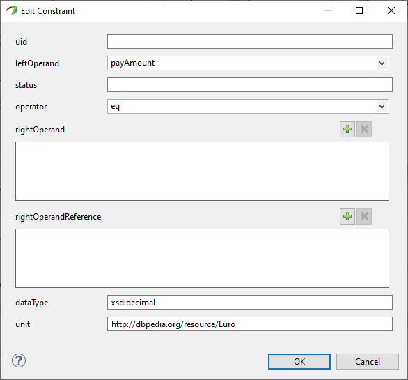
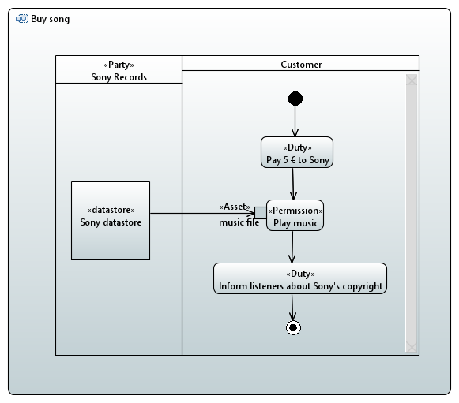
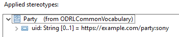
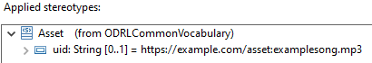
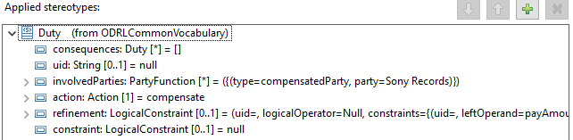
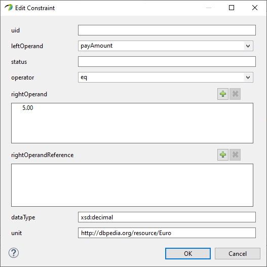
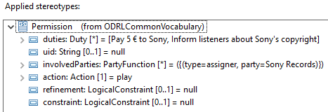
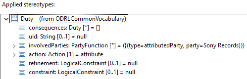

# Data Usage Control Policy Creation (Uconpolicycreation)

This plugin performs the analysis and transformation of models annotated with stereotypes from the ODRLCommonVocabulary profile, which is is provided by the plugin carisma.profile.uconpolicycreation.odrl.common.
The underlying diagrams are UML activity diagrams, the stereotypes contained in the profile relate to concepts of the Open Digital Rights Language (ODRL) for specifying usage control policies.

The only check contained in this plugin is the uconpolicycreation check.
The check reads usage-control-specific information from a UML-model with the ODRLCommonVocabulary-profile applied and checks, whether that information makes for a valid usage control policy.
If that is the case, the check additionally creates a file containing a machine readable version of the policy in JSON-LD-form.
Otherwise found errors in the displayed policy are listed in a report that can be generated from the analysis.

The location, name and extension of the output file are set by the user through a check parameter.
Another check parameter allows performing the check for model validity without creating a file.

## Using the ODRLCommonVocabulary UML Profile to model Policies

ODRL usage control policy elements are modelled by applying stereotypes to UML diagram elements and filling their tags.
Whether a tag entry is mandatory generally can be seen from its cardinality.
If its cardinality allows 0, the entry is optional.
Otherwise it's mandatory.
Further details about the creation of policy elements through the stereotypes are written below:

- **Policy:**
Apply the &lt;&lt;ODRL-Policy&gt;&gt; stereotype to the Activity at the top of an Activity Diagram.
    - Attributes:
      - uid: Makes the Policy referrable from outside the Model.
      - conflictStrategy: Decides how conflicts between Rules arising within the policy are resolved.
      - policyType: Decides the Type of Policy modelled.
      - profiles: List containing the IDs of the ODRL-Profiles that the Policy conforms to.
      - inheritsFrom: List containing the IDs of the Policies that this Policy inherits from.
    - Additional Information:
      - Rules (Permissions, Prohibitions, Obligations) of this Policy are automatically taken from the Rules defined in the Actions contained in the Activity. Those referred by other Rules are not directly added to this Policy.
- **Rule:**
(Not directly created. Subclasses are stereotypes applied to Actions. Covers part of the Permission, Prohibition and Obligation specification)
    - Attributes:
      - uid: Refers to an external Rule defined elsewhere. Other Attributes need to be empty if this attribute is filled.
      - involvedParties: Declares that a Party is related to this Rule and its role. Both the Party and the role are declared inside the created entries.
      - action: Declares the Action which this Rule refers to. The role of the Action depends on the implementation of the Rule-stereotype used (Permission, Prohibition, Obligation).
      - refinement: Refines the action-Property with further details regarding the action. Creation of refinement is explained under the separate point "LogicalConstaint".
      - constraint: Constrains this Rule regarding its application. Creation of constraint is explained under the separate point "LogicalConstaint".
    - Additional Information:
      - Assets that are involved with this Rule are declared through Asset-stereotypes attached to Input- and OutputPins which are attached to the Action. An InputPin signifies an Asset in the target-role, an OutputPin one in the output-role. Only one such relation to an Asset may be declared for each Rule.
- **Permission** (is a **Rule**):
Apply the &lt;&lt;Permission&gt;&gt; stereotype to an Action contained in the Activity at the top of an Activity Diagram.
    - Attributes:
      - duties: Declares the Duties whose acceptance is required to obtain this Permission.
- **Prohibition** (is a **Rule**):
Apply the &lt;&lt;Prohibition&gt;&gt; stereotype to an Action contained in the Activity at the top of an Activity Diagram.
    - Attributes:
      - remedies: Declares the Duties which need to be fulfilled if this Prohibition is not adhered to.
- **Duty** (is a **Rule**):
Apply the &lt;&lt;Duty&gt;&gt; stereotype to an Action contained in the Activity at the top of an Activity Diagram.
    - Attributes:
      - consequence: Declares the Duties which need to be fulfilled if this Duty is not fulfilled. This Attribute must not be filled if this Duty is referred to in the consequence-property of another duty.
- **Asset**:
Apply the &lt;&lt;Asset&gt;&gt; stereotype to a Pin attached to an Action with a Rule-stereotype applied.
    - Attributes:
      - uid: Refers to an external Asset defined elsewhere. Other Attributes need to be empty if this attribute is filled.
- **AssetCollection** (is an **Asset**):
Apply the &lt;&lt;AssetCollection&gt;&gt; stereotype to a Pin attached to an Action with a Rule-stereotype applied.
    - Attributes:
      - source: Refers to an external definition of the collection of assets this AssetCollection is based on.
      - refinement: Selects the Assets of the collection referenced by the source-property that are used in this AssetCollection. Creation of refinement is explained under the separate point "LogicalConstaint".
- **Party**:
Apply the &lt;&lt;Party&gt;&gt; stereotype to an ActivityPartition.
    - Attributes:
      - uid: Refers to an external Party defined elsewhere. Other Attributes need to be empty if this attribute is filled.
- **PartyCollection** (is a **Party**):
Apply the &lt;&lt;PartyCollection&gt;&gt; stereotype to an ActivityPartition.
    - Attributes:
      - source: Refers to an external definition of the collection of parties this PartyCollection is based on.
      - refinement: Selects the Parties of the collection referenced by the source-property that are used in this PartyCollection. Creation of refinement is explained under the separate point "LogicalConstaint".
- **LogicalConstraint**:
Not defined through stereotype, but as attribute of other elements.
    - Attributes:
      - uid: Refers to an external LogicalConstraint defined elsewhere. Other Attributes need to be empty if this attribute is filled.
      - logicalOperator: Declares how the Constraints of the constraints-property are logically combined.
      - constraints: A List of Constraints contained by this LogicalConstraint.
    - Additional Information:
      - If Null is selected for the logicalOperator-property, this LogicalConstraint is not processed as a LogicalConstraint, but as the List of Constraints in the constraint-property instead.
- **Constraint**:
Not defined through stereotype, but as attribute of a LogicalConstraint.
    - Attributes:
      - uid: Refers to an external Constraint defined elsewhere. Other Attributes need to be empty if this attribute is filled.
      - leftOperand: Declares one left operand.
      - status: Declares information about a pre-existing status of the leftOperand.
      - operator: Declares how the operands are evaluated. Can contain a list-based or not-list-based operator.
      - rightOperand: A List of values for the right operand. The values are directly used as operand.
      - rightOperandReference: A List of references for the right operand. Those must be dereferenced before evaluation.
      - dataType: Declares the type of values contained in the rightOperand- and rightOperandReference-properties.
      - unit: Declares a unit used for the values contained in the rightOperand- and rightOperandReference-properties.
    - Additional Information:
      - Depending on whether the operator-property-value is list-based or not, rightOperand/rightOperandReference may be restricted to a single entry.
		

## Uconpolicycreation Examples

Here you can find examples for the uconpolicycreation check.

First a faulty model is shown that contains errors detected in the check.
Afterwards a corrected version of the model is covered in more detail and result of the check applicatipon to it shown.

### Faulty Model

In the incorrect example shown below the Action "Play music" does not have an object Pin with an Asset-type-stereotype attached.
Therefor the Permission represented by the &lt;&lt;Permission&gt;&gt; stereotype does not have an Asset to apply to, making it an invalid ODRL-element.

Furthermore there are problems with some missing entries in the stereotypes' attributes:

In the incorrect example, the &lt;&lt;Permission&gt;&gt; stereotype has the enumeration value 'Null' in the action tag.
As every permission needs to be related to exactly one action this too results in an invalid policy.

Another error in the example is, that a Constraint refining the "Pay 5€ to Sony"-Duty contains no rightOperand- or rightOperandReference-value, one of which is required.

Running the check on this erroneous model results in a failure-output as analysis result.

The messages generated in the corresponding report list the errors and their approximate location:

	Warning: Invalid Rule: Needs to have an action selected. Found in a Permission contained in the OpaqueActionImpl named Play music.
	Warning: Invalid Permission: Needs to have a relation of type target. Found in a Permission contained in the OpaqueActionImpl named Play music.
	Warning: Invalid Constraint: Needs to have either a rightOperand, or rightOperandReference, has neither. Found in a Constraint contained in the OpaqueActionImpl named Pay 5 € to Sony.
	
	WARNING: No policy-File was created. The resulting policy does not not adhere to the odrl-specification.

### Correct Model

In the correct example the &lt;&lt;Asset&gt;&gt; stereotype is added to the Pin bordering the "Play music"-Action.

For the creation of the Policy all stereotypes applied in the example model are covered below.

The &lt;&lt;Policy&gt;&gt; stereotype applied to the "Buy song"-Activity contains the mandatory uid, the policy type "Offer" and the id of the ODRL-profile that it adheres to.

The &lt;&lt;Party&gt;&gt; stereotype applied to the "Sony Records"-Partition contains the id representing Sony.

The &lt;&lt;Asset&gt;&gt; stereotype applied to the "music file"-Pin contains the id representing the music file to be played.

The &lt;&lt;Duty&gt;&gt; stereotype applied to the "Pay 5€ to Sony"-Action contains sony as compensated party i.e. the party to be paid, the action "compensate" and a constraint specifying the payment.

The constraint refining the payment is defined through a single Constraint contained in an otherwise empty LogicalConstraint entered in the refinement-Attribute of the Duty.
It contains the information that the payment amount is equal to 5 Euro.

The &lt;&lt;Permission&gt;&gt; stereotype applied to the "Play music"-Action contains the two duties that need to be fulfilled for excercising the Permission, Sony as assigner of the rule and the action "play".

The &lt;&lt;Duty&gt;&gt; stereotype applied to the "Inform listeners about Sony's copyright"-Action contains sony as attributed party i.e. the party to be credited and the action "attribute".

Applying the check to this model generates, besides an analysis report with a success message, a file containing the ODRL-Policy in JSON-LD-form.
The contents of that output file can be seen seen below.
The elements seen in the diagram can be found in the JSON-LD-text.
As no custom ordering for the elements has been implemented however, the readability of the policy may not be optimal.

	{
	    "uid": "http:///example.com/policy:1234",
	    "permission": [{
	        "assigner": "https://example.com/party:sony",
	        "duty": [
	            {
	                "action": [{
	                    "refinement": [{
	                        "unit": "http://dbpedia.org/resource/Euro",
	                        "leftOperand": "payAmount",
	                        "operator": "eq",
	                        "rightOperand": {
	                            "@type": "xsd:decimal",
	                            "@value": "5.00"
	                        }
	                    }],
	                    "rdf:value": {"@id": "odrl:compensate"}
	                }],
	                "compensatedParty": "https://example.com/party:sony"
	            },
	            {
	                "attributedParty": "https://example.com/party:sony",
	                "action": "attribute"
	            }
	        ],
	        "action": "play",
	        "target": "https://example.com/asset:examplesong.mp3"
	    }],
	    "@context": "http://www.w3.org/ns/odrl.jsonld",
	    "@type": "Offer",
	    "profile": "http://www.umlsec.de/profiles/ODRLCommonVocabulary"
	}
