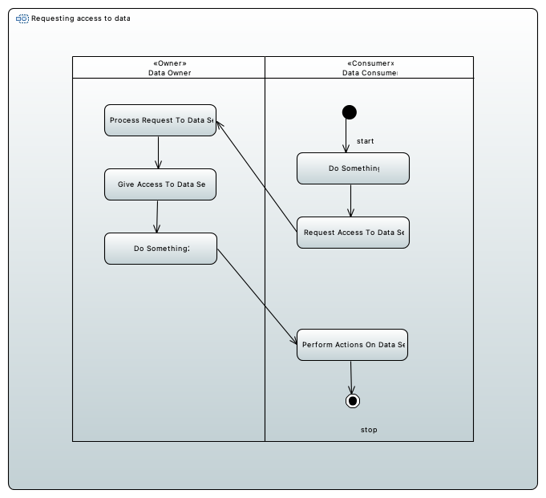
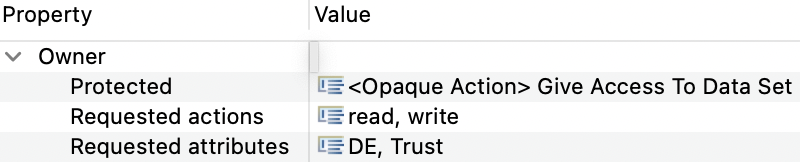
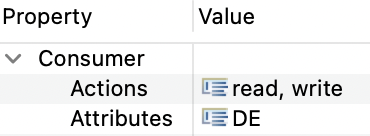
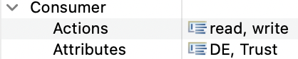

# Data Access Control for IDS Examples
Here you can find examples for the data access control check for IDS.

This check ensures, that a protected action of an owner can only be executed, if the requested attributes and actions are fulfilled by the consumer that wants access to a resource.
In the incorrect example, the &lt;&lt;Owner&gt;&gt; stereotype `read` and `write` in the requested actions tag.
Therefore, the &lt;&lt;Consumer&gt;&gt; stereotype must not contain something different in his actions tag.
This is fulfilled, since &lt;&lt;Consumer&gt;&gt; has `read` and `write` in his actions tag as well.
In addition to that the requested attributes of the &lt;&lt;Owner&gt;&gt; and attributes of &lt;&lt;Consumer&gt;&gt; must exactly match.
This is not the case in our example since `Trust` is contained in the owners requested attributes but not in the consumers attributes.
So the check will fail, when the protected action `Give Access To Data Set` is executed, which is the case here.

In the correct example, `Trust` is added to the consumers attributes and the check is successful.

