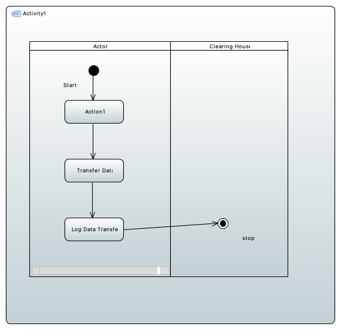
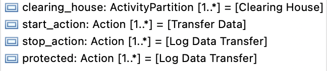
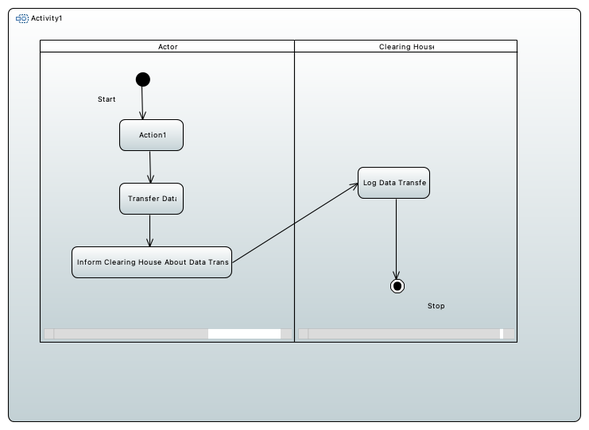
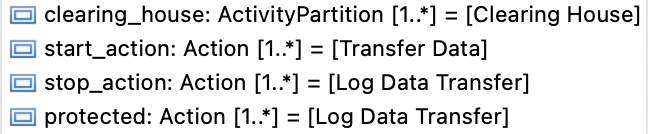

# Data Provenance Tracking for IDS Examples
Here you can find examples for the data provenance tracking check for IDS.
It checks if the tested model is correct related to clearing tasks.
The stereotype `dataprovenancetracking` which is applied to an Activity, you want to check clearing tasks for.

It has the tags "Clearing House", "Start Action", "Stop Action" and "Protected".
The tag "Clearing House" denotes which Partition representing an actor does all the clearing tasks.
The "Start Action" tag should contain every action that a clearing house should keep track of.
The actual tracking action should be modeled within the clearing house actor and added to the "Stop Action" tag.
It is important that a stop action is at the same place than his start action as (start_action, stop_action) like tuples are build within the check.
At last, the "Protected" tag should contain all actions that only the clearing house is allowed to execute.

In the incorrect example above, the "Actor" tries to do the clearing actions himself, whereas he does not have the capabilities to do that since he is not a clearing house.

Therefore, the check will fail.
In the correct example, the clearing house is logging the transfer and the check will succeed. 

