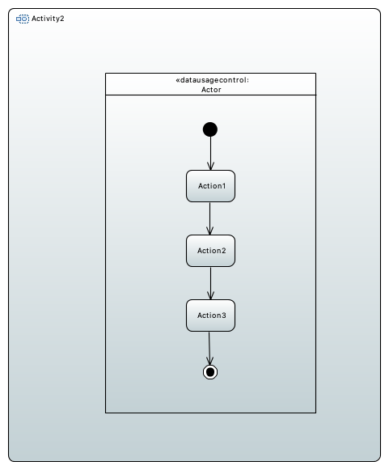
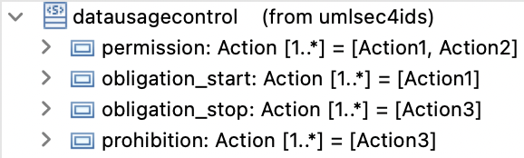
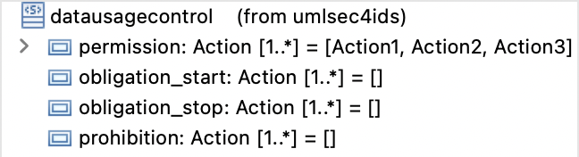

# Data Usage Control for IDS Examples
Here you can find examples for the data usage control check for IDS.
This check ensures, that prohibited actions must not be executed and that obligations are fulfilled, when a usage contract is signed by an owner and a consumer.
A consumer that accepted a data usage contract is gets the stereotype `datausagecontrol` assigned to the partition representing him.
This stereotype has 4 tags which are "prohibition", "permission", "obligation_start" and "obligation_stop".
These tags are filled with actions that are either permitted, prohibitted or require another action to be executed (obligation_stop) when a certain action is exexuted before (obligation_start) is for a given actor.

In the incorrect example, the "Actor" tries to execute a prohibited action "Action3", while he is permitted to execute "Action3" and "Action2".
Furthermore, the "Actor" has the obligation to execute "Action3", after "Action1" is executed, which is the case in this example.

Therefore, the check will fail and adds the prohibited action and the actor to the report.
In the correct model each executed action is permitted.
So the check will be successful.

