# Create a new Papyrus Project

## Requirements
- Install Eclipse
- Install Papyrus for Eclipse
- Install CARiSMA for Eclipse

## Creating a model
1. Create a new Papyrus project. Alternatively use an existing project as container for your models and select *Papyrus Model* in the dialog (*File* → *New* → *Papyrus Model*).
2. Select *UML* as the model type.
3. Enter a name for your Papyrus project.
4. Enter the *Diagram Name* and select the diagram type you want to create. Check that you want to load an UML model with basic primitive types as a template - this will make modeling easier for you. Optionally, you can directly register the the UMLsec profile for your project, by clicking ”Browse Registered Profiles”.
5. Choose the UMLsec profile and click *OK* and afterwards *Finish* to open the new empty diagram.

## Importing the UMLsec profile after model creation
1. If the model is open, close the *.di* file of your project.
2. In the *Project Explorer* open the *.uml* file of your model.
3. Select the <Model> element in the UML Model Editor.
4. Select the menu item *UML Editor* → *Package* → *Apply Profile*.
5. Select the *UMLsec* profile in the appearing window.
6. Click *Add* to apply the profile and *OK* to confirm your decision.
7. Save your project.
8. If you re-open your model in Papyrus, the UMLsec profile is added and its stereotypes may be applied.

## Analyzing a model with CARiSMA
1. You created a model, applied the UMLsec profile and stereotypes/tags.
2. Click *File*, then *New* and then *Other*.
3. Choose *CARiSMA* and then *Analysis*.
4. Select a model to be analyzed.
5. Select the *.uml* file of your created model.
6. Open the created *.adf* file and press the ”+” button.
7. Choose a suitable check for the model you created.
8. Run the check and obtain the result.
9. If the check fails, create a report.
10. View the report and obtain the results.
11. Correct the model according to the check.
12. Run the check again and observe if it is correct.

## Create a PNG or JPEG from a model

1. Open model
2. Right click in free drawing area
3. Choose File 
4. Save Image As File...

# Preference Settings

## CARiSMA Preference Settings
The CARiSMA settings can be customized by the user. 
Open Window → Preferences and choose CARiSMA on the left side, so the CARiSMA preference page is shown

### Open model settings
Depending on the analysis settings, the defined model may change during the execution. 
So the user may like to edit or review the used model. 
The *Open a Model with* settings in CARiSMA's main preference page specify the editors to be used when opening a model using the *Open Model* button. 

### Editor selection combo box
If you want to select a different editor for each analysis file, select the *Editor selection combo box* option.
By clicking on the *Open Model* button in Analysis Editor, the editor chosen in *Associated Editor* combo box (e.g. Eclipse's TextEditor, Papyrus, etc.) will appear. 
The selected editor will be applied just for the current opening. 
If the analysis is saved, the *Associated Editor* selection will be saved too. 

### Priority List
To define an ordered list of editors for automatically opening of a model, select this option.
Use the *Select ModelType* combo box to define editor priority lists for the different model types (e.g. UML2, BPMN2). 
Use *Add* or *Remove* buttons to add currently available editors into the ordered list or remove an editor from it. 
There must be at least one entry. 

The first entry in the list has the highest priority. If opening the model with this entry fails, the next entry will be taken automatically. There are currently following editors supported:
* **Default Eclipse Editor** is not a specific editor. With this option, the editor which is selected by eclipse by default is chosen.
* **Text Editor** opens the model file as text.
* **UML Model Editor** opens an uml model with its default editor.
* **Papyrus** search for the graphical file of the model (di file extension) in the same folder as the model itself, and if it exists it will be opened with the Papyrus editor.
* **ECORE Editor** opens the model file in a basic EMF ecore editor.

# BPMN2 Guides

## The OCL Library

### Creating an OCL Library File
The OCL-Library model provides the possibility to save OCL-Constraints. 
Therefore the Library can be used to load necessary constraints during an analysis.
First you need to create a model file. 
Therefore open the Creation Wizard by right clicking on your Workspace, select "New" then "Other" or use Hotkey CTRL + N. 
Following screen should appear. 
Select the OCL Model.
To manage multiple ocl constraints it is necessary to declare the "Library" Object as root element. 
In further releases this step might not be performed anymore.

### Example : Creating an OCL-Library
1. Create an OCL-Model
2. (Chose the Library Object as root element)
3. Insert an OCL-Expression, which must contain a context and a query string

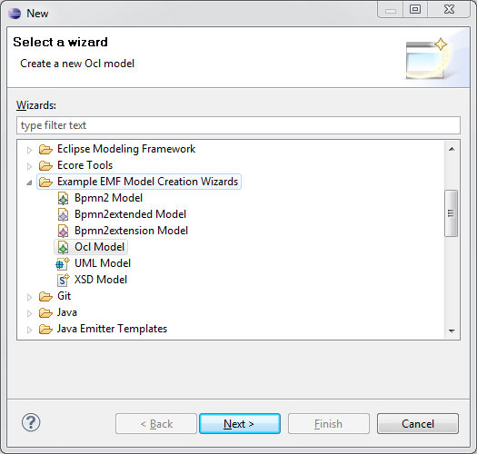
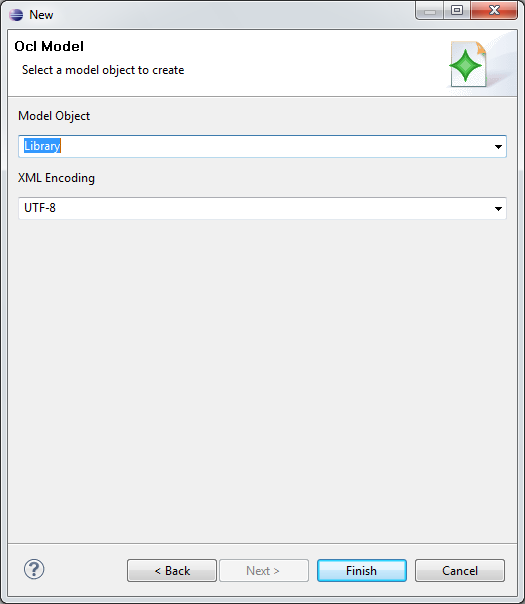
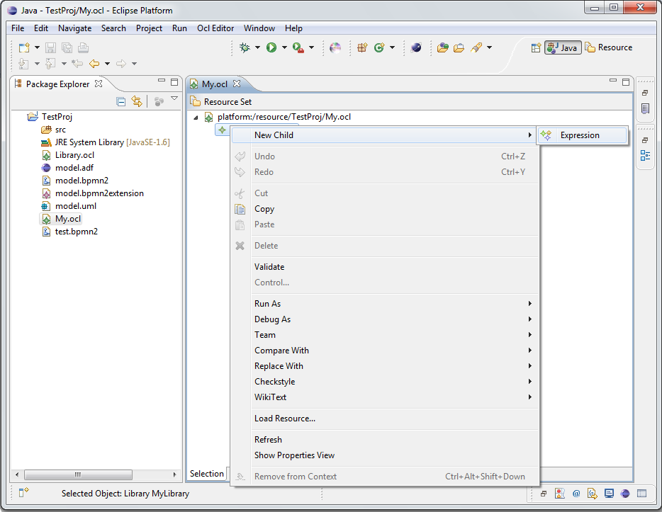
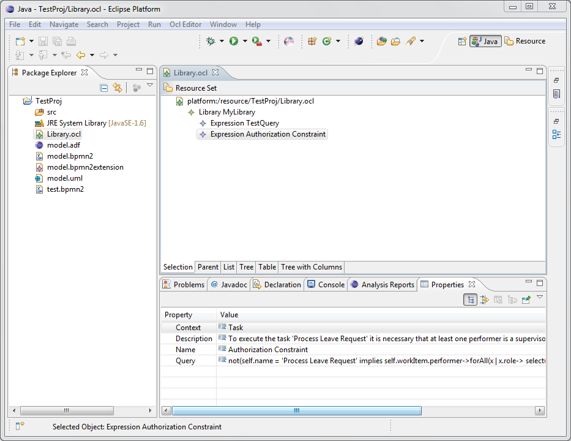

### Using an OCL Library File
After creating an OCL Library File it is possible to add your individual ocl constraints to the library. 
Later on, these constraints can be deleted and modified as well. 
To add a constraint open the model file and add a constraint by right clicking on the library root element.
To modify an OCL constraint it is necessary to open the properties view (Select Menu "Window" then "Show View").

### Extension Model
The Extension Model offers the possibility to extend special BPMN 2.0 elements by additional entity objects. 
The additional information provides the necessary context to perform an analysis, which validates for example authorization or resource allocation constraints.

### Example: Creating Extension Model

1. Create Bpmn2extension Model
2.(Chose the Root object as root element)
3. The Wizard should show all extensible elements otherwise create a clone of the element which should be extended (name must be equal)
4. Insert additional information to an element by referencing additional entities to the clone

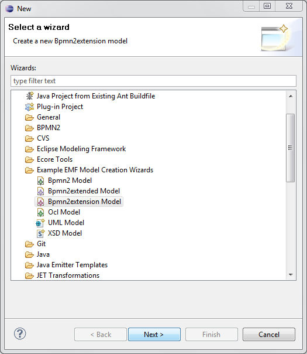
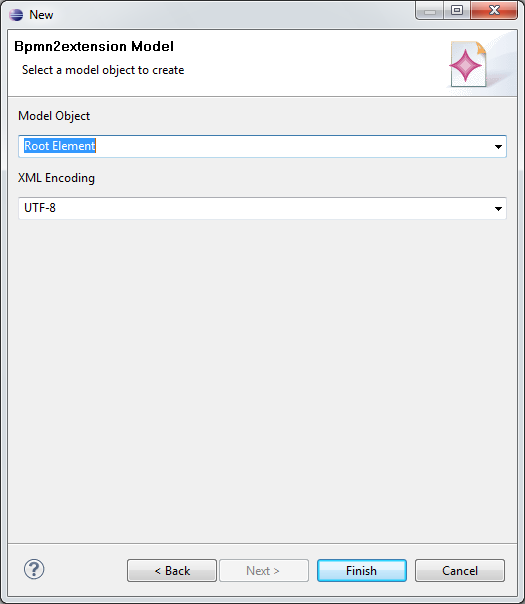
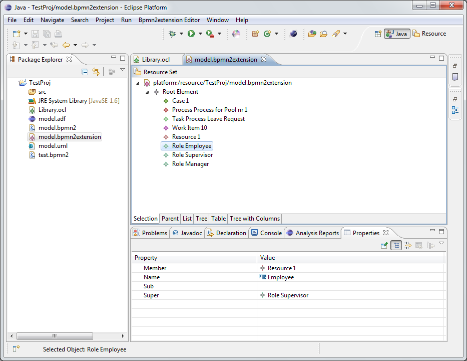

### Using the BPMN2 OCL Check
With this Check it is possible to query bpmn2 models with OCL expressions. 
The result will show the model elements, which does not fit to the defined constraint.

### Example: Querying a Model
1. Create an analysis description file
2. Select the BPMN2 OCL Check
3. Select an OCL-Library
4. Define the OCL-Constraints which should be validated
 	* Create a documentation node with the text «pattern={X}» in the BPMN2 model (must be a child of the definition node). The Variable X stands for the wild-card parameter „*“, an index of the OCL-Library [0..n] or the name of the constraint.
	* Samples: «pattern={*}» or «pattern={SoD}» or «pattern={1,SoD,BoD}»
5. (Optional) Extend the BPMN 2.0 model by linking to the extension model
	* Create a documentation node with the text «ext=filename.bpmn2extension» in the BPMN2 model (must be a child of the definition node). The extension model must be stored in the same folder.
6. Run the Check

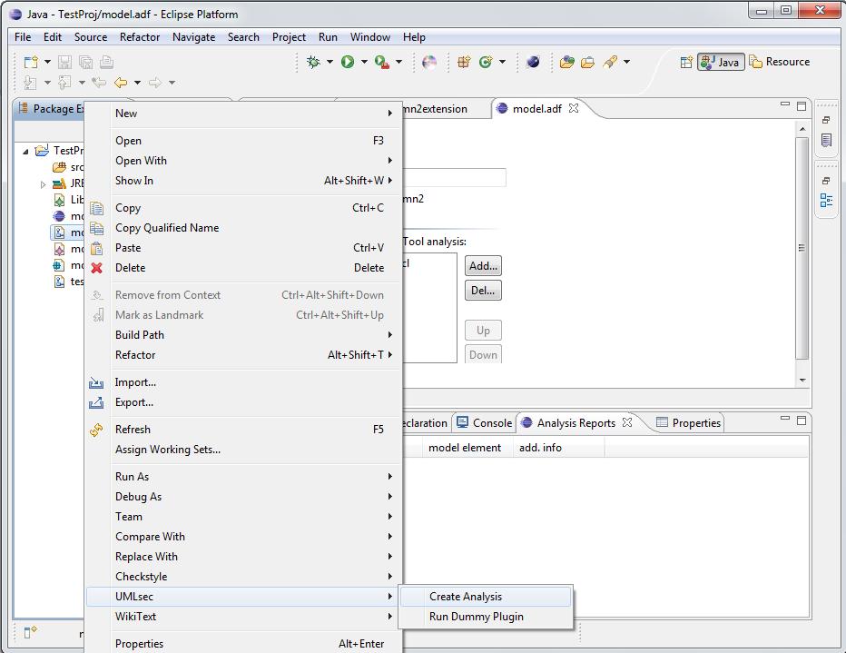
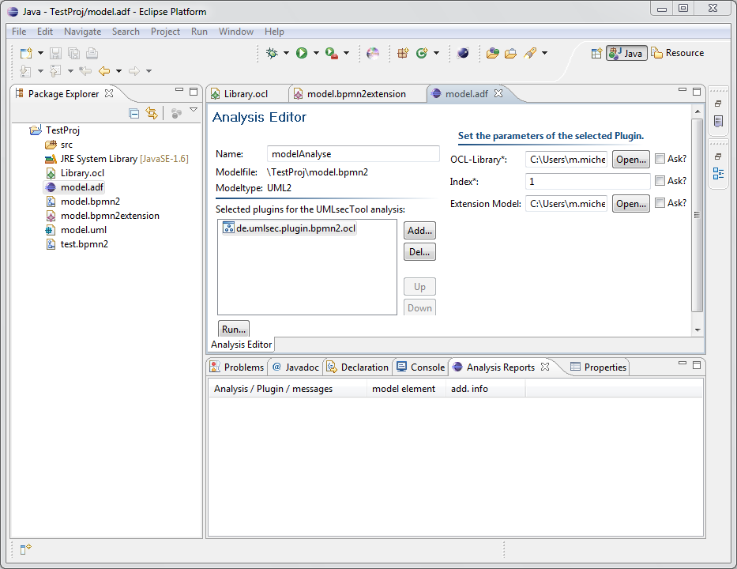
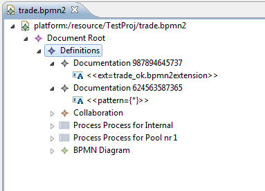
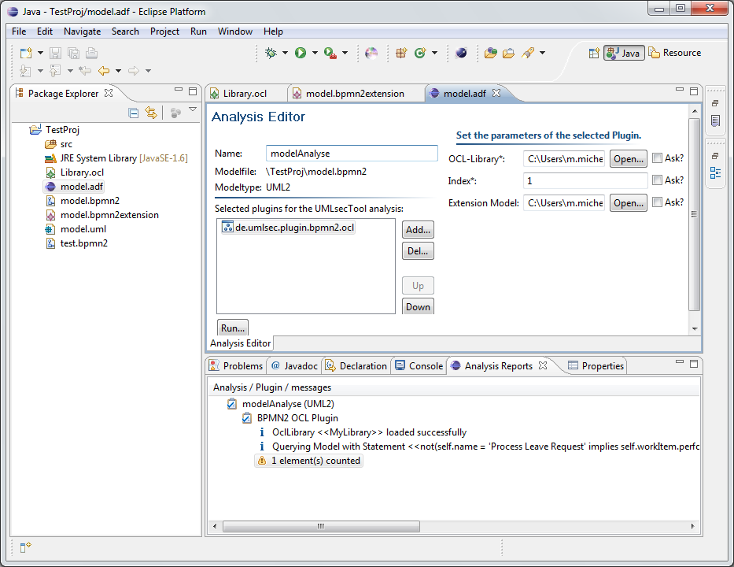
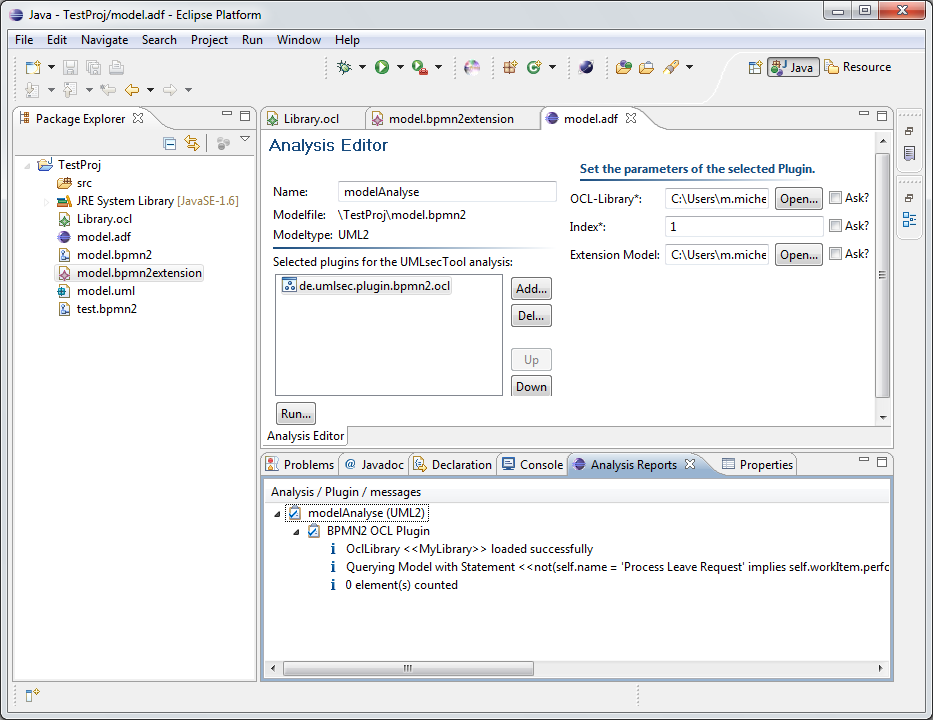

### Example: Applying the Separation of Duty (SoD) Constraint
The Separation of Duty constraint describes the concept of having at least two people involved to complete a process.

The following BPMN diagram illustrates a very simple trade workflow. 
In regard to the Separation of Duty concept, it is necessary that the tasks „Enter Trade Request“ and „Check Trade Request“ or „Check Trade Request“ and „Process Decision“ are performed by different users.

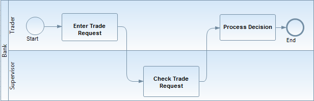

To model such a conflict, it is necessary to extend the standard BPMN 2.0 model with the extension model.
The extension model owns an singleton element „ConflictSet“, which refers to conflicting Tasks.

#### Validating the SoD Constraint

* Create an extension model
	* Create the tasks „Enter Trade Request“ and „Check Trade Request“
	* Define a „Conflict Set“, which refers to the created tasks
	* Add several workItems to the tasks and create roles, which must be assigned to the workItems
* Create an OCL-Expression for the SoD pattern
* Query the model

# Online Help
Additional help on the CARiSMA-Tool can be found in the online help, when CARiSMA is already installed.
1. Open Eclipse
2. Click *Help*.
3. Choose *Help Contents*.
4. A page will open with different contents for different installations.
5. Select the *CARiSMA* help.