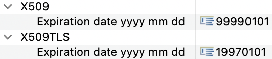
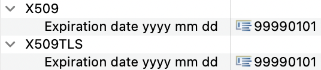

# Identity Management for IDS Examples

Here, you can find examples for the identity management check for IDS.
It check if each node, which represents an IDS Connector, is annotated with the stereotypes `X.509` and `X.509TLS`.
These symbolize the certificates each Connector needs, to participate in the International Data Space.
Both stereotypes have the tag "Expiration Date YYYY MM DD", which denotes the expiration date of the given certificate for a certain Connentor.
These are checked against the current local time and the check fails if the date denoted in the tag is in the past. 
The check also verifies if the expiration date is a correct date of format YYYY-MM-DD, since the expiration dates needed to be added manually.

In the incorrect example, there is a missing `X.509` certificate at the node representing Connector1 and an expired date for the `X.509TLS` certificate at Connector2.
Therefore, the check will fail at this example and add these mistakes to the report.

In the correct example, there are both certificates at both nodes. 
Additionally, the date denoted in the "Expiration Date YYYY MM DD" is in the future.
So the check will succeed.

