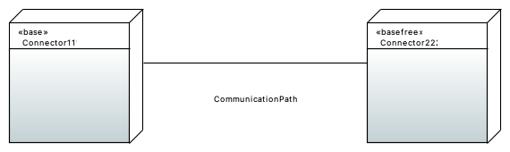

# Trust Management for IDS Examples
Here you can find examples for the trust management check for IDS.
It checks if each node object is anotated with a security profile.
Otherwise the check will fail.

If each node hast a security profile, represented through a stereotype, the communication rules are checked.
Trustplus can have a bidirectional communication to Trust and Base and a one sided communication to Basefree.
A check will provide information as it will not fail here.
Trust can have a bidirectional communication to Trustplus and Base and a one sided communication to Basefree.
A check will provide information as it will not fail here.
Base can have a bidirectional communication to Trustplus and Trust and must not communicate to Basefree nodes.
A check will fail if there is a connection between Base and Basefree.
Basefree can have a one sided communication to Trustplus and Trust and must not communicate to Base nodes.
A check will fail if there is a connection between Base and Basefree.

In the incorrect example, there is a communication path between two nodes, one with the `Base` and the other one with the `Basefree` security profile.
Therefore, the check will fail.

In the correct example, a node with `Base` communicates with a `Trust` node.
So the check will succeed.

