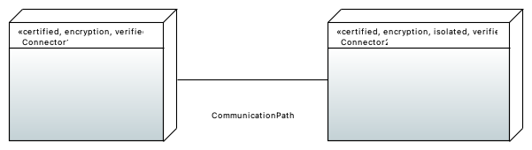
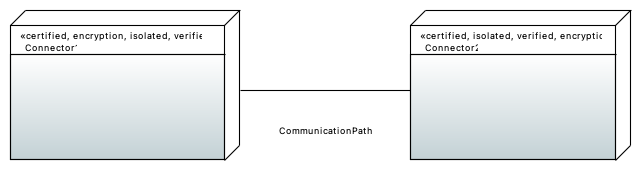

# Trusted Platform for IDS Examples

Here, you can find examples for the trusted platform check for IDS.
It check if each node, which represents an IDS Connector, is annotated with the stereotypes `certified`, `encryption`, `isolated` and `verified`.
These symbolize a collection of security features each Connector needs, to participate in the International Data Space and should be applied if a Connector fulfills the requirements of this category.

In the incorrect example, there is a missing `isolated` stereotype at the node representing Connector1 which means that this Connector does not fulfill the required isolation requirements for participation in the IDS.
Therefore, the check will fail at this example and add the mistake to the report.

In the correct example, there are all the required stereotypes at both nodes. 
So the check will succeed.

